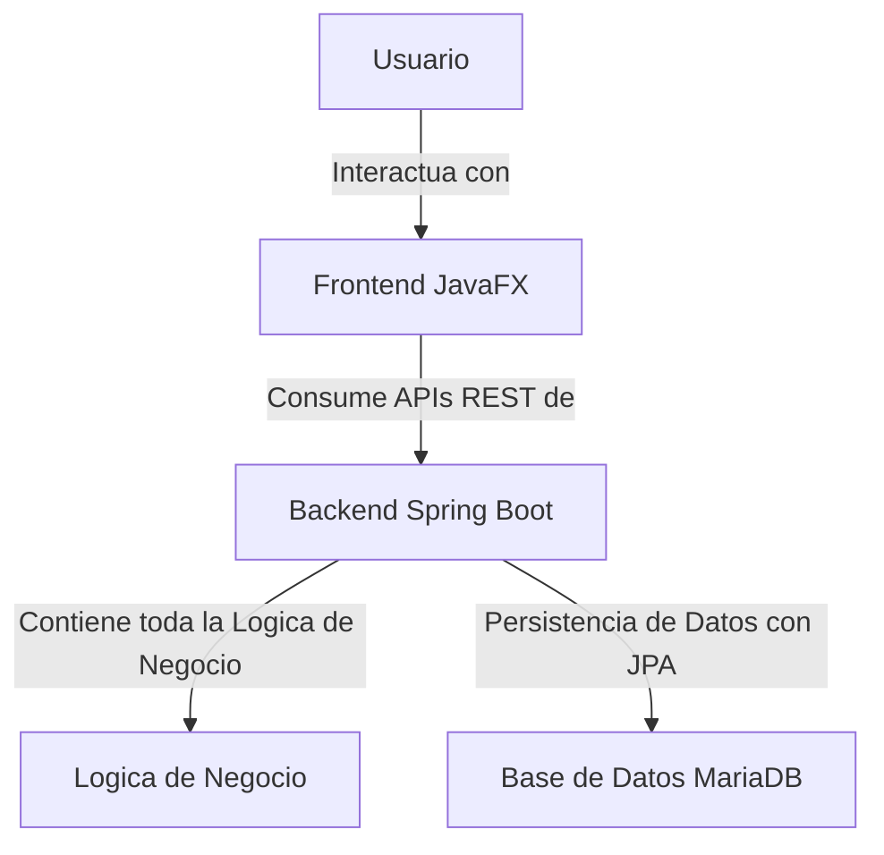

## Análisis de la Arquitectura de la Aplicación YBioC

### 1. Estado Actual de la Aplicación

El proyecto `YBioC` presenta una arquitectura híbrida en proceso de migración, combinando elementos de una aplicación Spring Boot con una interfaz de usuario en JavaFX, y manteniendo un proyecto "viejo" basado en Java Swing que contiene la lógica de negocio original.

#### Componentes Principales:

*   **Backend (Spring Boot):**
    *   `pom.xml`: Define las dependencias del proyecto. Incluye `spring-boot-starter-data-jpa`, `spring-boot-starter-web-services`, `spring-boot-starter-security`, y drivers para MariaDB. También se observa la inclusión de `lombok` para reducir código boilerplate.
    *   `application.yaml`: Configura las propiedades de la aplicación. Se define el nombre de la aplicación (`ybioq`), el tipo de aplicación web como `none` (lo que indica que Spring Boot no se inicia como un servidor web tradicional, sino que se integra con la aplicación JavaFX), y las configuraciones para dos bases de datos MariaDB (una local y otra remota).
    *   `src/main/java/com/ybc/ybioq/YbioqApplication.java`: Punto de entrada principal de la aplicación Spring Boot, que lanza la aplicación JavaFX (`YbioqFxApplication.class`).
    *   Paquetes como `service`, `repository`, `entity`, `controller`, `config`, `exception`, `model`, y `utils` sugieren una estructura de backend estándar de Spring Boot, con capas de servicio, acceso a datos (JPA), manejo de entidades, controladores (posiblemente para APIs REST si `spring-boot-starter-web-services` se usa para eso), y utilidades.
        *   Ejemplo: `LoginService.java` utiliza `UsuarioRepository` y `BCryptPasswordEncoder` para la autenticación de usuarios, lo que indica un sistema de seguridad implementado.

*   **Frontend (JavaFX):**
    *   `src/main/java/com/ybc/ybioq/fx/YbioqFxApplication.java`: La clase principal de la aplicación JavaFX. Se encarga de iniciar el contexto de Spring Boot en un hilo separado, cargar la pantalla de inicio (`splash-view.fxml`), y manejar la navegación entre vistas JavaFX (por ejemplo, `login-view.fxml`).
    *   `src/main/resources/fx/`: Contiene los archivos FXML (como `login-view.fxml`, `main-view.fxml`, `splash-view.fxml`) y CSS (`styles.css`) para la interfaz de usuario de JavaFX.
    *   `src/main/java/com/ybc/ybioq/view/`: Esta carpeta contiene clases Java para formularios Java Swing (ej. `Pacientes.java`, `Observacion.java`, etc.) y sus respectivos archivos `.form`. Esto confirma que hay una parte significativa de la UI que aún es Java Swing, y el mensaje indica que se está migrando a JavaFX.

*   **Proyecto Antiguo (Java Swing / Lógica de Negocio):**
    *   `src/main/java/com/ybc/ybioq/viejo/ybgestor-cobiar/`: Esta es la ubicación del proyecto antiguo. Contiene subcarpetas `Clases` y `Formularios`.
        *   `Formularios/`: Incluye numerosos archivos `.form` y `.java` para interfaces de Java Swing (ej., `Login.java`, `Pacientes.java`, `Informe.java`), que contienen tanto la interfaz de usuario como una cantidad significativa de lógica de negocio.
        *   `Clases/`: Contiene lógica de negocio y utilidades más desacopladas del proyecto antiguo (ej., `ConexionMySQL.java`, `ClaseAnalisis.java`, `Practicas.java`).

### 2. Arquitectura Actual y Propuesta

Actualmente, la aplicación es un monolito que intenta evolucionar. El backend Spring Boot se encarga de la persistencia de datos (JPA con MariaDB) y la lógica de seguridad, mientras que el frontend utiliza una combinación de Java Swing (del proyecto antiguo y parcialmente en el nuevo) y JavaFX (en el proyecto nuevo, con implementación mínima). La aplicación se lanza como una aplicación JavaFX que luego inicia el contexto de Spring Boot.

#### Diagrama de Arquitectura Actual:

```mermaid
graph TD
    User[Usuario] -->|Interactua con| JavaFX_App[Aplicacion JavaFX]
    JavaFX_App -->|Inicia y usa servicios de| SpringBoot_Backend[Backend Spring Boot]
    JavaFX_App -->|Interactua directamente con| Java_Swing_Views[Vistas Java Swing (proyecto nuevo)]
    Java_Swing_Views -->|Contiene logica de negocio y UI de| Old_Swing_Project[Proyecto Viejo (Java Swing)]
    Old_Swing_Project -->|Accede a (posiblemente directamente)| MariaDB[Base de Datos MariaDB]
    SpringBoot_Backend -->|Accede a| MariaDB
```

**Observaciones:** La arquitectura actual presenta una mezcla de tecnologías y responsabilidades. La lógica de negocio está dispersa entre el proyecto Swing antiguo (incluyendo sus formularios) y, en menor medida, en los formularios Swing del proyecto nuevo. La aplicación JavaFX actual es principalmente un shell que lanza Spring Boot y gestiona la navegación básica. El proyecto antiguo también utiliza "vistas" de base de datos o consultas directas en lugar de relaciones de ORM completas.

#### Propuesta de Desacoplamiento:

El objetivo es desacoplar completamente el backend del frontend. Esto implica:

1.  **Migrar toda la lógica de negocio** del proyecto `viejo` (Java Swing, incluyendo la incrustada en formularios) y la lógica existente en los formularios del proyecto nuevo al backend de Spring Boot, exponiéndola a través de APIs RESTful.
2.  **Eliminar las vistas de Java Swing** del proyecto `ybioq` y reemplazar toda la funcionalidad de la UI con JavaFX, que interactuará exclusivamente con el backend Spring Boot a través de las APIs.
3.  **Considerar el diseño de la base de datos (entidades)** como una guía clave durante la migración de la lógica de negocio, alineando las operaciones con el modelo de datos.
4.  **Gestionar los reportes** en una segunda instancia, una vez que la lógica de negocio principal y el desacoplamiento estén avanzados.

#### Diagrama de Arquitectura Propuesta:



### 3. Plan de Acción (TODO List)

Me gustaría confirmar el siguiente plan para desacoplar el backend del frontend y migrar la lógica de negocio. Por favor, revisa los pasos y hazme saber si estás de acuerdo o si te gustaría añadir o modificar algo.

```markdown
[ ] Realizar un análisis detallado de la lógica de negocio en los formularios y clases del proyecto viejo (ybgestor-cobiar) y del proyecto nuevo.
[ ] Definir y modelar las entidades de la base de datos en el proyecto Spring Boot (`entity` package) basándose en la estructura de la base de datos existente y las necesidades de la lógica de negocio.
[ ] Migrar la lógica de negocio identificada a servicios y componentes del backend de Spring Boot.
[ ] Crear APIs RESTful en el backend de Spring Boot para exponer la lógica de negocio migrada.
[ ] Refactorizar progresivamente las vistas de Java Swing (del proyecto nuevo y viejo) a componentes de JavaFX, asegurando que interactúen con las nuevas APIs RESTful.
[ ] Eliminar por completo los archivos y dependencias de Java Swing una vez que la migración sea completa y verificada.
[ ] Implementar pruebas unitarias y de integración para la nueva lógica de negocio en el backend y la interacción del frontend con las APIs.
[ ] Planificar y abordar la migración o reimplementación de los reportes en una fase posterior.
[ ] Actualizar la documentación del proyecto con la nueva arquitectura y los detalles de la migración.
```

¿Estás de acuerdo con este plan ajustado? ¿Hay algo más que te gustaría discutir antes de proceder?